# AI 智能投标系统技术方案

**文档编号**：TSD-BIDAI-2026-001  
**版本**：V1.0  
**编制日期**：2026-04-13  
**文档状态**：技术评审阶段  
**密级**：内部保密

---

## 目录

1. [背景与目标](#1-背景与目标)
2. [现状分析](#2-现状分析)
3. [总体架构设计](#3-总体架构设计)
4. [详细设计](#4-详细设计)
5. [实施路径](#5-实施路径)
6. [风险与应对](#6-风险与应对)
7. [运维与治理](#7-运维与治理)
8. [主要收益](#8-主要收益)
9. [附录](#9-附录)

---

## 1. 背景与目标

### 1.1 项目背景

随着市场竞争加剧，企业参与政府采购、工程招标及商业招投标的频次持续提升。投标工作呈现以下显著特征：

- **高频次、高强度**：单月参与投标项目数量多，编标周期短，人员长期处于高压状态。
- **经验高度依赖个人**：优质标书的编写质量严重依赖少数有经验的投标专员，人员流动风险大。
- **重复劳动突出**：约 60%~70% 的标书内容（资质文件、业绩证明、人员简历、技术方案框架）在不同标书之间重复使用，但缺乏有效的复用机制。
- **合规风险难以管控**：投标过程中因格式错误、数据不一致、证件过期等导致废标的情况时有发生，损失显著。
- **知识无法沉淀**：历次投标的经验教训、优质内容均停留在个人硬盘或记忆中，无法形成组织层面的知识积累。

上述问题直接导致企业中标率偏低、投标成本居高不下、新人培养周期长等核心痛点，亟需通过系统化、智能化手段加以解决。

### 1.2 项目目标

本项目旨在建设一套覆盖投标全生命周期的 AI 智能投标系统，实现以下核心目标：

| 目标维度 | 量化指标 | 实现路径 |
|---|---|---|
| 提升中标率 | 综合中标率提升 15%~25% | 胜率预测 + AI 辅助编写 + 模拟评标 |
| 降低人力成本 | 单标书编制工时降低 50% 以上 | 知识库复用 + 三分法路由自动生成 |
| 消除废标风险 | 因格式/数据错误导致的废标降至 0 | 智能交叉检查 + 合规自审 |
| 知识资产积累 | 3 年内建成 500+ 项目的结构化知识库 | 历史入库 + 复盘沉淀机制 |
| 降低人才依赖 | 新人独立完成标书时间从 3 个月缩短至 2 周 | AI 辅助 + 专家知识外化 |

### 1.3 建设原则

- **AI 辅助，人工主导**：AI 负责繁重的结构化、检索、生成工作，关键决策节点保留人工审核，确保质量可控。
- **数据安全优先**：标书涉及核心商业机密，系统设计从一开始即将数据安全、访问控制、审计追踪纳入核心架构。
- **渐进式建设**：按优先级分期上线，快速验证核心价值，避免一次性大规模投入的风险。
- **知识闭环驱动**：将系统使用过程本身作为知识积累的机制，越用越智能。

---

## 2. 现状分析

### 2.1 现状痛点

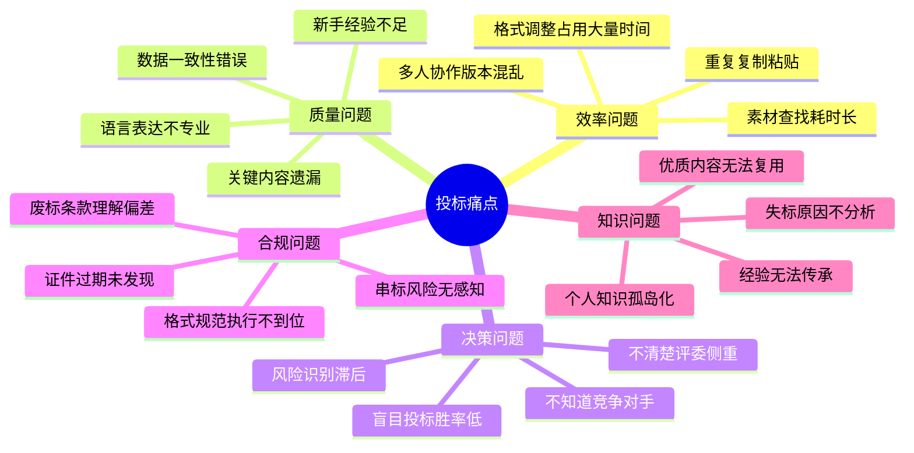
```mermaid
mindmap
  root((投标痛点))
    效率问题
      素材查找耗时长
      重复复制粘贴
      多人协作版本混乱
      格式调整占用大量时间
    质量问题
      新手经验不足
      数据一致性错误
      关键内容遗漏
      语言表达不专业
    决策问题
      盲目投标胜率低
      不知道竞争对手
      不清楚评委侧重
      风险识别滞后
    合规问题
      证件过期未发现
      废标条款理解偏差
      串标风险无感知
      格式规范执行不到位
    知识问题
      经验无法传承
      失标原因不分析
      优质内容无法复用
      个人知识孤岛化
```

### 2.2 现有流程分析

**现有投标流程（As-Is）：**

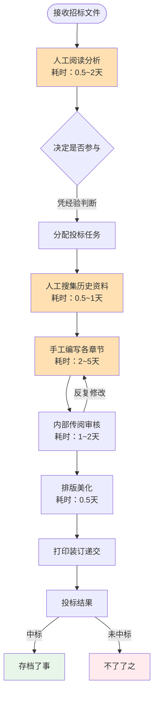
```mermaid
flowchart TD
    A([接收招标文件]) --> B[人工阅读分析\n耗时：0.5~2天]
    B --> C{决定是否参与}
    C -->|凭经验判断| D[分配投标任务]
    D --> E[人工搜集历史资料\n耗时：0.5~1天]
    E --> F[手工编写各章节\n耗时：2~5天]
    F --> G[内部传阅审核\n耗时：1~2天]
    G -->|反复修改| F
    G --> H[排版美化\n耗时：0.5天]
    H --> I[打印装订递交]
    I --> J[投标结果]
    J -->|中标| K[存档了事]
    J -->|未中标| L[不了了之]

    style B fill:#FFE0B2
    style E fill:#FFE0B2
    style F fill:#FFE0B2
    style K fill:#E8F5E9
    style L fill:#FFEBEE
```

**主要问题量化：**

| 环节 | 当前耗时 | 主要问题 |
|---|---|---|
| 招标文件解读 | 4~16 小时 | 纯人工阅读，要点易遗漏 |
| 素材收集 | 4~8 小时 | 分散在各人硬盘，查找困难 |
| 内容编写 | 16~40 小时 | 大量重复工作，质量参差不齐 |
| 审核修改 | 8~16 小时 | 缺乏标准，意见主观分散 |
| 合规检查 | 2~4 小时 | 依赖个人经验，易遗漏 |
| **合计** | **34~84 小时** | — |

### 2.3 竞品与行业现状

当前市场上已有部分投标辅助工具，但普遍存在以下局限性：

- **模板化工具为主**：提供固定模板，无法根据招标文件动态调整，适配性差。
- **缺乏知识库建设**：未能有效沉淀企业自身的历史投标知识，复用性弱。
- **AI 能力浅层**：仅做简单文字生成，缺乏合规审查、语义匹配、数据一致性检查等深度能力。
- **数据安全薄弱**：多为 SaaS 公有云部署，企业核心数据存在泄露风险。

本系统将通过**企业私有化部署 + 深度 RAG + 全流程覆盖**形成核心差异化竞争优势。

---

## 3. 总体架构设计

### 3.1 系统架构总览

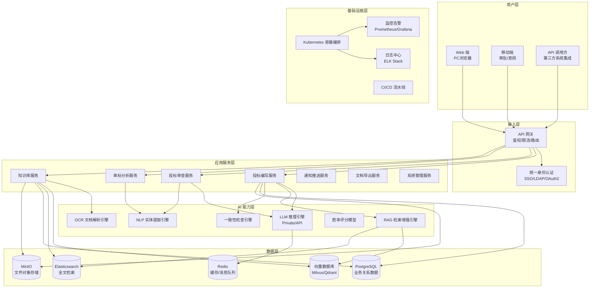
```mermaid
graph TB
    subgraph 用户层
        WEB[Web 端\nPC浏览器]
        MOBILE[移动端\n审批/查阅]
        API_CLIENT[API 调用方\n第三方系统集成]
    end

    subgraph 接入层
        GW[API 网关\n鉴权/限流/路由]
        SSO[统一身份认证\nSSO/LDAP/OAuth2]
    end

    subgraph 应用服务层
        BID_SVC[投标编写服务]
        REVIEW_SVC[投标审查服务]
        COLLUDE_SVC[串标分析服务]
        KB_SVC[知识库服务]
        NOTIFY_SVC[通知推送服务]
        EXPORT_SVC[文档导出服务]
        ADMIN_SVC[系统管理服务]
    end

    subgraph AI 能力层
        LLM[LLM 推理引擎\nPrivate/API]
        RAG[RAG 检索增强引擎]
        OCR[OCR 文档解析引擎]
        NLP[NLP 实体提取引擎]
        SCORE[胜率评分模型]
        CHECK[一致性检查引擎]
    end

    subgraph 数据层
        PG[(PostgreSQL\n业务关系数据)]
        ES[(Elasticsearch\n全文检索)]
        VECTOR[(向量数据库\nMilvus/Qdrant)]
        MINIO[(MinIO\n文件对象存储)]
        REDIS[(Redis\n缓存/消息队列)]
    end

    subgraph 基础设施层
        K8S[Kubernetes 容器编排]
        MONITOR[监控告警\nPrometheus/Grafana]
        LOG[日志中心\nELK Stack]
        CICD[CI/CD 流水线]
    end

    WEB --> GW
    MOBILE --> GW
    API_CLIENT --> GW
    GW --> SSO
    GW --> BID_SVC
    GW --> REVIEW_SVC
    GW --> COLLUDE_SVC
    GW --> KB_SVC

    BID_SVC --> LLM
    BID_SVC --> RAG
    BID_SVC --> CHECK
    REVIEW_SVC --> LLM
    REVIEW_SVC --> NLP
    COLLUDE_SVC --> NLP
    KB_SVC --> OCR
    KB_SVC --> VECTOR
    KB_SVC --> ES

    RAG --> VECTOR
    RAG --> ES
    LLM --> REDIS

    BID_SVC --> PG
    BID_SVC --> MINIO
    KB_SVC --> PG
    KB_SVC --> MINIO

    K8S --> MONITOR
    K8S --> LOG
```

### 3.2 技术选型

| 层次 | 组件 | 选型方案 | 选型理由 |
|---|---|---|---|
| 前端框架 | Web 端 | Vue 3 + TypeScript + Element Plus | 生态成熟，开发效率高 |
| 前端框架 | 移动端 | uni-app（H5/微信小程序双端） | 一套代码覆盖多端 |
| 后端框架 | 微服务 | Python FastAPI + Java Spring Boot | AI 服务用 Python，业务服务用 Java |
| API 网关 | 流量管理 | Kong / Nginx | 成熟稳定，插件丰富 |
| 关系数据库 | 业务数据 | PostgreSQL 15 | 支持 JSON 字段，开源稳定 |
| 全文检索 | 文本搜索 | Elasticsearch 8 | 中文分词支持好（IK 分词器）|
| 向量数据库 | 语义检索 | Milvus 2.x | 开源，高性能，支持私有化部署 |
| 对象存储 | 文件存储 | MinIO | 兼容 S3 协议，支持私有化 |
| 缓存/队列 | 高速缓存 | Redis 7 + Celery | 会话缓存 + 异步任务队列 |
| LLM 引擎 | 大语言模型 | 私有化部署优先（Qwen/DeepSeek）+ API 备用（GPT-4/Claude） | 数据安全第一 |
| OCR 引擎 | 文档解析 | PaddleOCR + PyMuPDF | 中文识别准确率高，开源免费 |
| 容器编排 | 部署管理 | Kubernetes（K8s）| 弹性伸缩，高可用 |
| 监控告警 | 系统监控 | Prometheus + Grafana | 业界标准，开箱即用 |
| 日志管理 | 日志收集 | ELK Stack（Elasticsearch + Logstash + Kibana）| 日志统一管理与分析 |

### 3.3 部署架构

```mermaid
graph TD
    subgraph 企业内网
        subgraph 应用集群
            APP1[应用节点 1]
            APP2[应用节点 2]
            APP3[应用节点 N]
        end

        subgraph AI 推理集群
            GPU1[GPU 节点 1\nLLM 推理]
            GPU2[GPU 节点 2\nOCR/NLP]
        end

        subgraph 数据集群
            DB_M[(PG 主节点)]
            DB_S[(PG 从节点)]
            ES_C[(ES 集群)]
            MILVUS[(Milvus 集群)]
            MINIO_C[(MinIO 集群)]
            REDIS_C[(Redis 主从)]
        end

        LB[负载均衡器\nNginx/F5]
        BASTION[堡垒机\n运维审计]
    end

    subgraph 互联网区域
        USER[用户终端]
        MOBILE_U[移动端用户]
    end

    subgraph 外部 API（可选/降级）
        EXT_LLM[外部 LLM API\n仅非敏感场景]
    end

    USER --> LB
    MOBILE_U --> LB
    LB --> APP1
    LB --> APP2
    LB --> APP3
    APP1 --> GPU1
    APP2 --> GPU1
    APP1 --> DB_M
    DB_M --> DB_S
    APP1 --> ES_C
    APP1 --> MILVUS
    APP1 --> MINIO_C
    APP1 --> REDIS_C
    BASTION --> APP1
    GPU1 -.->|降级备用| EXT_LLM
```

### 3.4 数据流架构

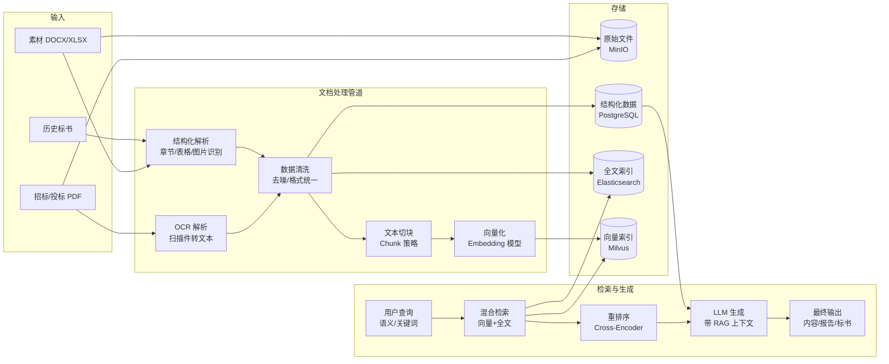
```mermaid
flowchart LR
    subgraph 输入
        PDF[招标/投标 PDF]
        DOCX[素材 DOCX/XLSX]
        HIST[历史标书]
    end

    subgraph 文档处理管道
        OCR_P[OCR 解析\n扫描件转文本]
        PARSE[结构化解析\n章节/表格/图片识别]
        CLEAN[数据清洗\n去噪/格式统一]
        CHUNK[文本切块\nChunk 策略]
        EMBED[向量化\nEmbedding 模型]
    end

    subgraph 存储
        RAW[(原始文件\nMinIO)]
        STRUCT[(结构化数据\nPostgreSQL)]
        FULL[(全文索引\nElasticsearch)]
        VEC[(向量索引\nMilvus)]
    end

    subgraph 检索与生成
        QUERY[用户查询\n语义/关键词]
        HYBRID[混合检索\n向量+全文]
        RERANK[重排序\nCross-Encoder]
        GEN[LLM 生成\n带 RAG 上下文]
        OUT[最终输出\n内容/报告/标书]
    end

    PDF --> OCR_P
    DOCX --> PARSE
    HIST --> PARSE
    OCR_P --> CLEAN
    PARSE --> CLEAN
    CLEAN --> CHUNK
    CHUNK --> EMBED
    CLEAN --> STRUCT
    CLEAN --> FULL
    EMBED --> VEC
    PDF --> RAW
    DOCX --> RAW

    QUERY --> HYBRID
    HYBRID --> FULL
    HYBRID --> VEC
    HYBRID --> RERANK
    RERANK --> GEN
    STRUCT --> GEN
    GEN --> OUT
```

---

## 4. 详细设计

### 4.1 企业级智能知识库（RAG 引擎）

#### 4.1.1 知识库数据模型

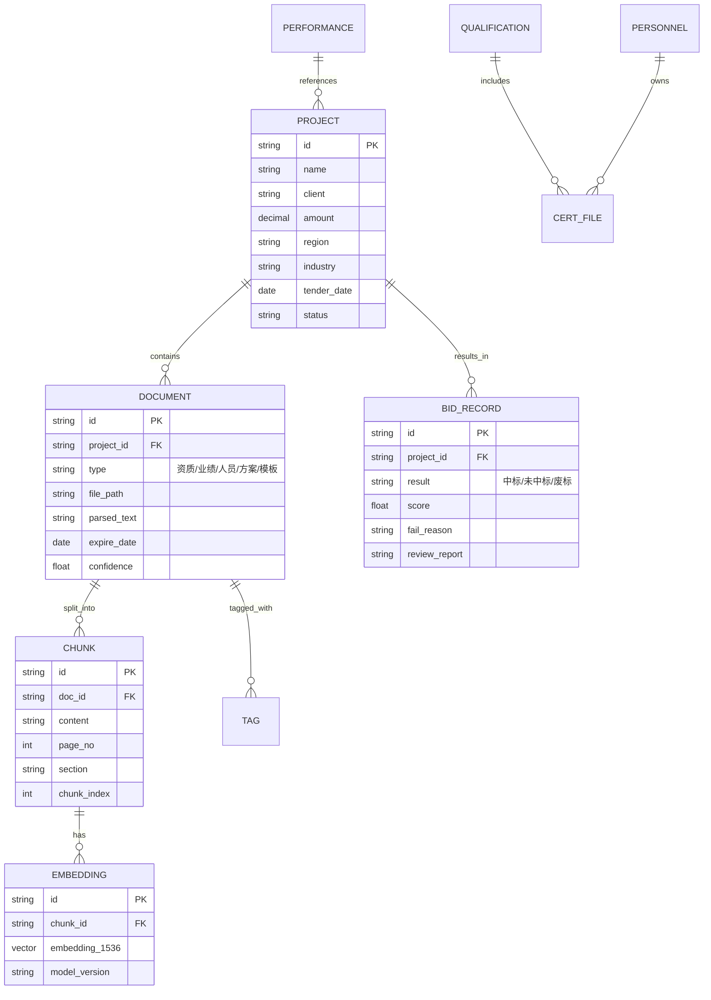
```mermaid
erDiagram
    PROJECT ||--o{ DOCUMENT : contains
    DOCUMENT ||--o{ CHUNK : split_into
    CHUNK ||--o{ EMBEDDING : has
    DOCUMENT ||--o{ TAG : tagged_with
    PROJECT ||--o{ BID_RECORD : results_in

    QUALIFICATION ||--o{ CERT_FILE : includes
    PERSONNEL ||--o{ CERT_FILE : owns
    PERFORMANCE ||--o{ PROJECT : references

    PROJECT {
        string id PK
        string name
        string client
        decimal amount
        string region
        string industry
        date tender_date
        string status
    }

    DOCUMENT {
        string id PK
        string project_id FK
        string type "资质/业绩/人员/方案/模板"
        string file_path
        string parsed_text
        date expire_date
        float confidence
    }

    CHUNK {
        string id PK
        string doc_id FK
        string content
        int page_no
        string section
        int chunk_index
    }

    EMBEDDING {
        string id PK
        string chunk_id FK
        vector embedding_1536
        string model_version
    }

    BID_RECORD {
        string id PK
        string project_id FK
        string result "中标/未中标/废标"
        float score
        string fail_reason
        string review_report
    }
```

#### 4.1.2 RAG 检索流程

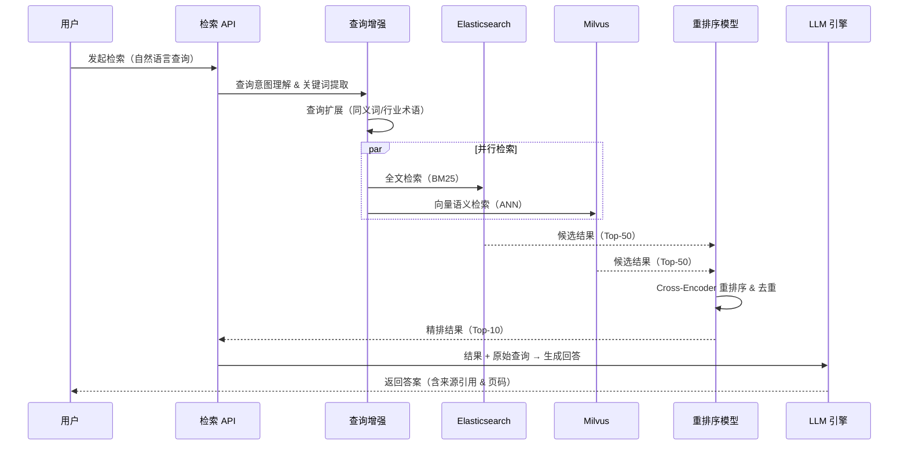
```mermaid
sequenceDiagram
    participant U as 用户
    participant API as 检索 API
    participant QE as 查询增强
    participant ES as Elasticsearch
    participant MV as Milvus
    participant RR as 重排序模型
    participant LLM as LLM 引擎

    U->>API: 发起检索（自然语言查询）
    API->>QE: 查询意图理解 & 关键词提取
    QE->>QE: 查询扩展（同义词/行业术语）

    par 并行检索
        QE->>ES: 全文检索（BM25）
        QE->>MV: 向量语义检索（ANN）
    end

    ES-->>RR: 候选结果（Top-50）
    MV-->>RR: 候选结果（Top-50）
    RR->>RR: Cross-Encoder 重排序 & 去重
    RR-->>API: 精排结果（Top-10）

    API->>LLM: 结果 + 原始查询 → 生成回答
    LLM-->>U: 返回答案（含来源引用 & 页码）
```

#### 4.1.3 文档入库流程

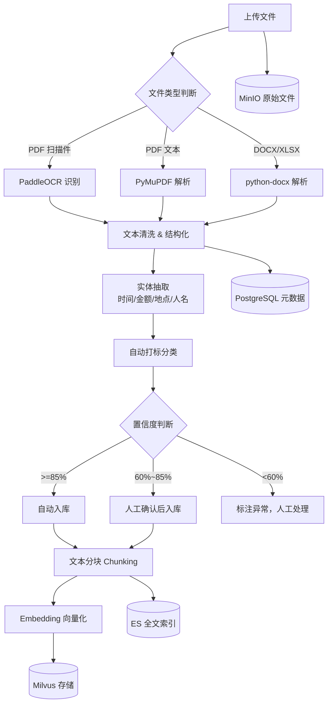
```mermaid
flowchart TD
    A[上传文件] --> B{文件类型判断}
    B -->|PDF 扫描件| C[PaddleOCR 识别]
    B -->|PDF 文本| D[PyMuPDF 解析]
    B -->|DOCX/XLSX| E[python-docx 解析]
    C --> F[文本清洗 & 结构化]
    D --> F
    E --> F
    F --> G[实体抽取\n时间/金额/地点/人名]
    G --> H[自动打标分类]
    H --> I{置信度判断}
    I -->|>=85%| J[自动入库]
    I -->|60%~85%| K[人工确认后入库]
    I -->|<60%| L[标注异常，人工处理]
    J --> M[文本分块 Chunking]
    K --> M
    M --> N[Embedding 向量化]
    N --> O[(Milvus 存储)]
    M --> P[(ES 全文索引)]
    F --> Q[(PostgreSQL 元数据)]
    A --> R[(MinIO 原始文件)]
```

### 4.2 招标文件解析引擎

#### 4.2.1 约束提取算法

招标文件约束提取采用**规则 + LLM 双路融合**策略，提升准确率与召回率：

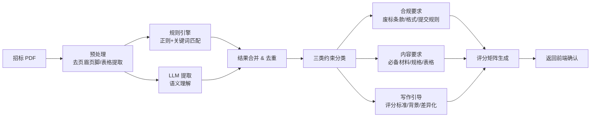
```mermaid
flowchart LR
    PDF[招标 PDF] --> PRE[预处理\n去页眉页脚/表格提取]
    PRE --> RULE[规则引擎\n正则+关键词匹配]
    PRE --> LLM_E[LLM 提取\n语义理解]
    RULE --> MERGE[结果合并 & 去重]
    LLM_E --> MERGE
    MERGE --> CLASS[三类约束分类]
    CLASS --> C1[合规要求\n废标条款/格式/提交规则]
    CLASS --> C2[内容要求\n必备材料/规格/表格]
    CLASS --> C3[写作引导\n评分标准/背景/差异化]
    C1 --> SCORE_M[评分矩阵生成]
    C2 --> SCORE_M
    C3 --> SCORE_M
    SCORE_M --> UI[返回前端确认]
```

**约束提取 Prompt 模板（核心设计）：**

```
系统角色：你是一位资深投标专家，擅长从招标文件中精准提取关键约束条件。

任务：从以下招标文件片段中，提取并分类所有约束条件。

分类标准：
1. 合规要求（COMPLIANCE）：不满足即废标的刚性条件
2. 内容要求（CONTENT）：标书必须包含的材料和格式规定  
3. 写作引导（GUIDE）：评分标准、差异化亮点、项目背景信息

输出格式（JSON）：
{
  "constraints": [
    {
      "id": "C001",
      "type": "COMPLIANCE|CONTENT|GUIDE",
      "content": "约束条款原文",
      "location": {"page": 5, "section": "第三章"},
      "is_veto": true|false,
      "score": null|{max: 40, dimension: "技术分"},
      "confidence": 0.95
    }
  ]
}

招标文件片段：{chunk}
```

#### 4.2.2 评分矩阵自动生成

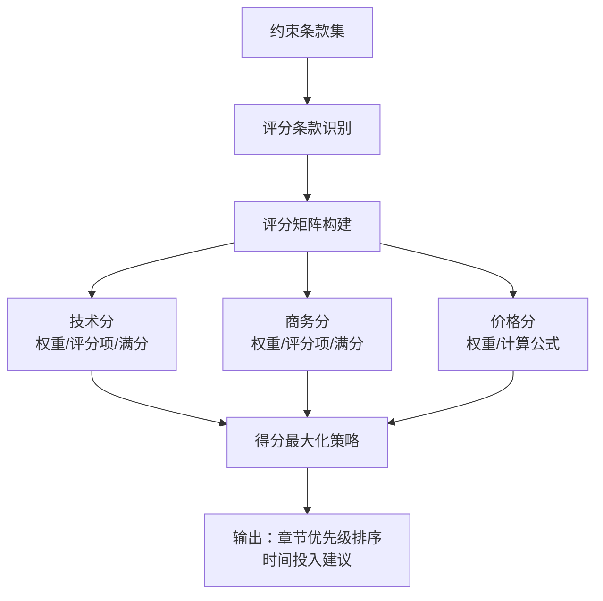
```mermaid
graph TD
    CS[约束条款集] --> SCORE_EXT[评分条款识别]
    SCORE_EXT --> MATRIX[评分矩阵构建]
    MATRIX --> T[技术分\n权重/评分项/满分]
    MATRIX --> B[商务分\n权重/评分项/满分]
    MATRIX --> P[价格分\n权重/计算公式]
    T --> STRATEGY[得分最大化策略]
    B --> STRATEGY
    P --> STRATEGY
    STRATEGY --> OUT[输出：章节优先级排序\n时间投入建议]
```

### 4.3 AI 协同编写引擎

#### 4.3.1 三分法路由设计

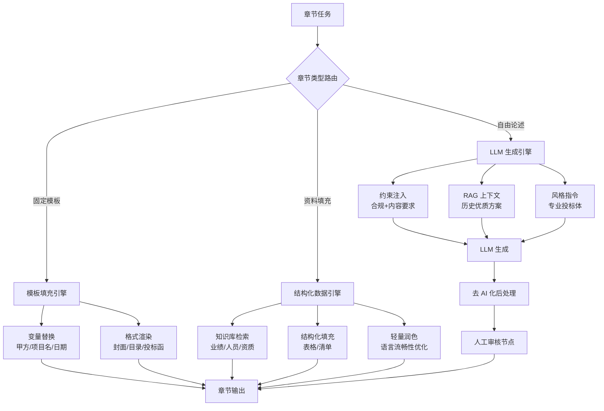
```mermaid
flowchart TD
    SEC[章节任务] --> ROUTER{章节类型路由}

    ROUTER -->|固定模板| TPL[模板填充引擎]
    ROUTER -->|资料填充| DATA[结构化数据引擎]
    ROUTER -->|自由论述| GEN_AI[LLM 生成引擎]

    TPL --> V1[变量替换\n甲方/项目名/日期]
    TPL --> F1[格式渲染\n封面/目录/投标函]

    DATA --> D1[知识库检索\n业绩/人员/资质]
    DATA --> D2[结构化填充\n表格/清单]
    DATA --> D3[轻量润色\n语言流畅性优化]

    GEN_AI --> G1[约束注入\n合规+内容要求]
    GEN_AI --> G2[RAG 上下文\n历史优质方案]
    GEN_AI --> G3[风格指令\n专业投标体]
    G1 --> G4[LLM 生成]
    G2 --> G4
    G3 --> G4
    G4 --> G5[去 AI 化后处理]
    G5 --> G6[人工审核节点]

    V1 --> OUT[章节输出]
    F1 --> OUT
    D1 --> OUT
    D2 --> OUT
    D3 --> OUT
    G6 --> OUT
```

#### 4.3.2 全局变量系统设计

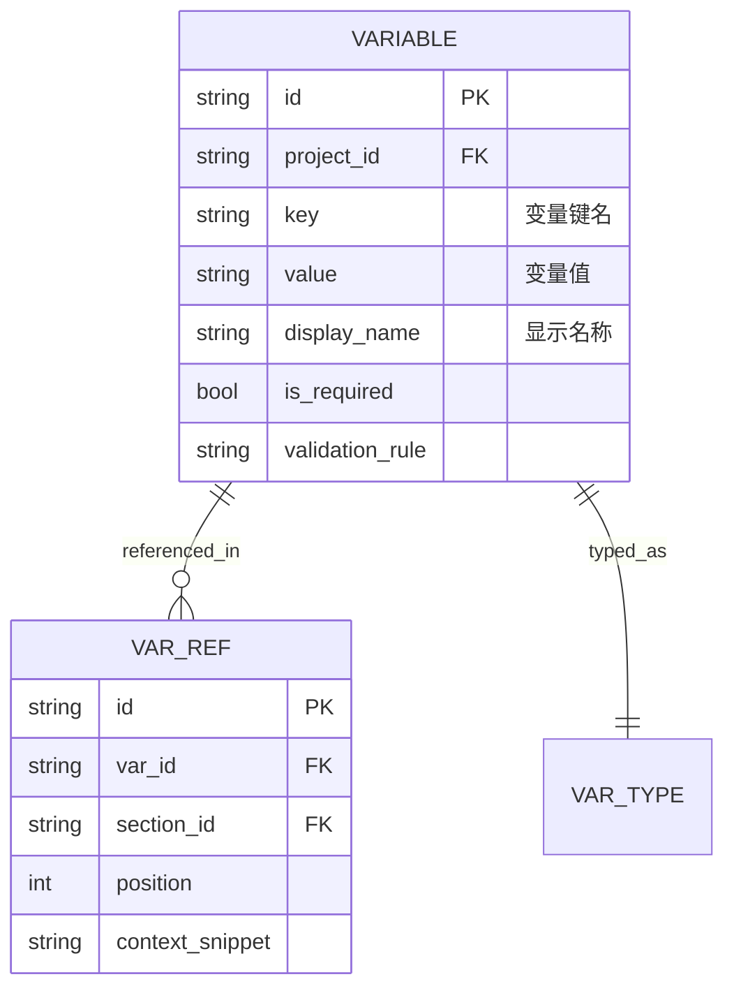
```mermaid
erDiagram
    VARIABLE ||--o{ VAR_REF : referenced_in
    VARIABLE ||--|| VAR_TYPE : typed_as

    VARIABLE {
        string id PK
        string project_id FK
        string key "变量键名"
        string value "变量值"
        string display_name "显示名称"
        bool is_required
        string validation_rule
    }

    VAR_REF {
        string id PK
        string var_id FK
        string section_id FK
        int position
        string context_snippet
    }
```

系统预置变量（可扩展）：

| 变量键 | 显示名称 | 示例值 |
|---|---|---|
| `{{CLIENT}}` | 招标方名称 | 某市公共资源交易中心 |
| `{{PROJECT_NAME}}` | 项目名称 | XX 智慧城市信息化建设项目 |
| `{{BIDDER}}` | 投标方名称 | XX 科技有限公司 |
| `{{AMOUNT}}` | 投标报价 | 人民币伍佰万元整 |
| `{{DURATION}}` | 项目工期 | 180 日历天 |
| `{{DEADLINE}}` | 递交截止时间 | 2026 年 5 月 20 日 17:00 |
| `{{LEGAL_REP}}` | 法定代表人 | 张三 |
| `{{CONTACT}}` | 联系人及电话 | 李四 / 138xxxx8888 |

#### 4.3.3 智能交叉检查引擎

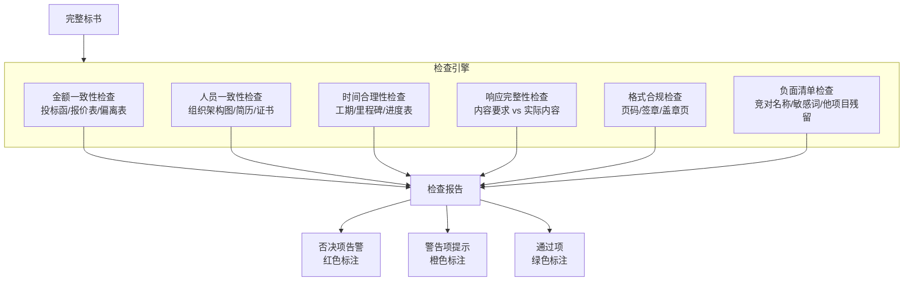
```mermaid
graph TD
    DOC[完整标书] --> CHECK

    subgraph CHECK[检查引擎]
        C1[金额一致性检查\n投标函/报价表/偏离表]
        C2[人员一致性检查\n组织架构图/简历/证书]
        C3[时间合理性检查\n工期/里程碑/进度表]
        C4[响应完整性检查\n内容要求 vs 实际内容]
        C5[格式合规检查\n页码/签章/盖章页]
        C6[负面清单检查\n竞对名称/敏感词/他项目残留]
    end

    C1 --> REPORT[检查报告]
    C2 --> REPORT
    C3 --> REPORT
    C4 --> REPORT
    C5 --> REPORT
    C6 --> REPORT

    REPORT --> VETO[否决项告警\n红色标注]
    REPORT --> WARN[警告项提示\n橙色标注]
    REPORT --> PASS[通过项\n绿色标注]
```

### 4.4 胜率预测模型

#### 4.4.1 模型架构

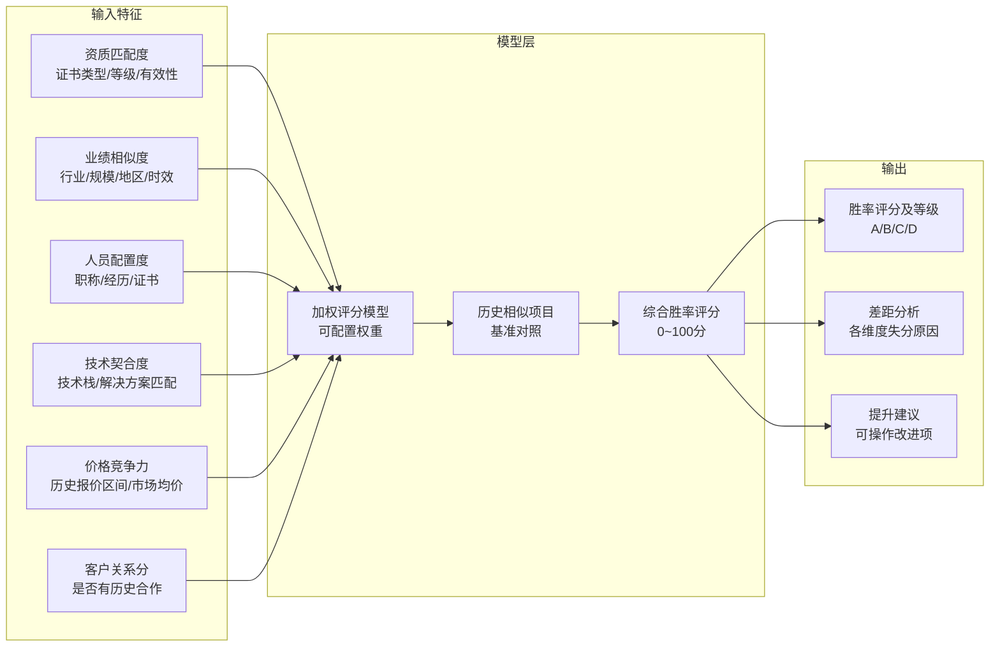
```mermaid
graph LR
    subgraph 输入特征
        F1[资质匹配度\n证书类型/等级/有效性]
        F2[业绩相似度\n行业/规模/地区/时效]
        F3[人员配置度\n职称/经历/证书]
        F4[技术契合度\n技术栈/解决方案匹配]
        F5[价格竞争力\n历史报价区间/市场均价]
        F6[客户关系分\n是否有历史合作]
    end

    subgraph 模型层
        F1 --> WM[加权评分模型\n可配置权重]
        F2 --> WM
        F3 --> WM
        F4 --> WM
        F5 --> WM
        F6 --> WM
        WM --> HIST_M[历史相似项目\n基准对照]
        HIST_M --> FINAL[综合胜率评分\n0~100分]
    end

    subgraph 输出
        FINAL --> SCORE_OUT[胜率评分及等级\nA/B/C/D]
        FINAL --> GAP[差距分析\n各维度失分原因]
        FINAL --> SUGGEST[提升建议\n可操作改进项]
    end
```

#### 4.4.2 胜率评分规则

| 维度 | 权重（默认）| 评分方式 | 说明 |
|---|---|---|---|
| 资质匹配度 | 25% | 规则匹配 | 必备资质满足得满分，每缺一项扣分 |
| 业绩相似度 | 30% | 语义相似度 | 历史业绩与本项目要求的语义匹配分 |
| 人员配置度 | 20% | 规则匹配 | 关键岗位人员资质满足情况 |
| 技术契合度 | 15% | LLM 评估 | 技术方向与招标方技术栈的匹配程度 |
| 价格竞争力 | 10% | 历史数据 | 预估报价在历史中标区间的概率 |

> 权重可由项目经理根据项目类型手动调整。

### 4.5 合规审查与串标分析引擎

#### 4.5.1 合规审查流程

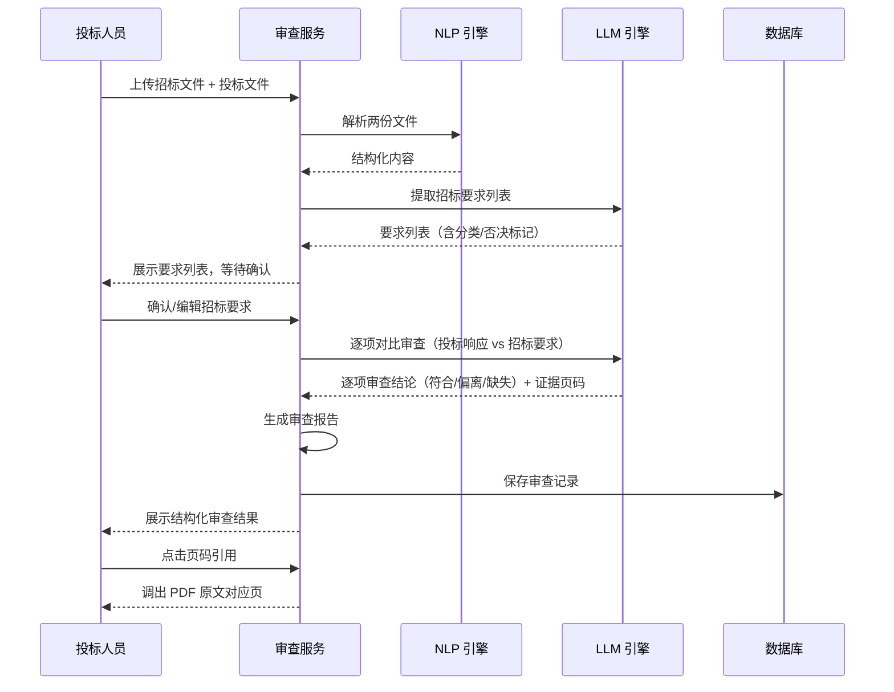
```mermaid
sequenceDiagram
    participant USER as 投标人员
    participant SVC as 审查服务
    participant NLP as NLP 引擎
    participant LLM as LLM 引擎
    participant DB as 数据库

    USER->>SVC: 上传招标文件 + 投标文件
    SVC->>NLP: 解析两份文件
    NLP-->>SVC: 结构化内容
    SVC->>LLM: 提取招标要求列表
    LLM-->>SVC: 要求列表（含分类/否决标记）
    SVC-->>USER: 展示要求列表，等待确认
    USER->>SVC: 确认/编辑招标要求
    SVC->>LLM: 逐项对比审查（投标响应 vs 招标要求）
    LLM-->>SVC: 逐项审查结论（符合/偏离/缺失）+ 证据页码
    SVC->>SVC: 生成审查报告
    SVC->>DB: 保存审查记录
    SVC-->>USER: 展示结构化审查结果
    USER->>SVC: 点击页码引用
    SVC-->>USER: 调出 PDF 原文对应页
```

#### 4.5.2 串标分析多维度模型

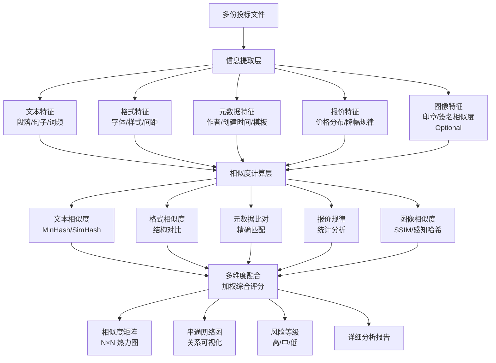
```mermaid
graph TD
    FILES[多份投标文件] --> EXT[信息提取层]

    EXT --> TXT_F[文本特征\n段落/句子/词频]
    EXT --> FMT_F[格式特征\n字体/样式/间距]
    EXT --> META_F[元数据特征\n作者/创建时间/模板]
    EXT --> PRICE_F[报价特征\n价格分布/降幅规律]
    EXT --> IMG_F[图像特征\n印章/签名相似度\nOptional]

    TXT_F --> SIM[相似度计算层]
    FMT_F --> SIM
    META_F --> SIM
    PRICE_F --> SIM
    IMG_F --> SIM

    SIM --> TXT_SIM[文本相似度\nMinHash/SimHash]
    SIM --> FMT_SIM[格式相似度\n结构对比]
    SIM --> META_SIM[元数据比对\n精确匹配]
    SIM --> PRICE_SIM[报价规律\n统计分析]
    SIM --> IMG_SIM[图像相似度\nSSIM/感知哈希]

    TXT_SIM --> FUSE[多维度融合\n加权综合评分]
    FMT_SIM --> FUSE
    META_SIM --> FUSE
    PRICE_SIM --> FUSE
    IMG_SIM --> FUSE

    FUSE --> MATRIX[相似度矩阵\nN×N 热力图]
    FUSE --> NETWORK[串通网络图\n关系可视化]
    FUSE --> RISK[风险等级\n高/中/低]
    FUSE --> REPORT[详细分析报告]
```

### 4.6 权限与安全设计

#### 4.6.1 RBAC 权限模型

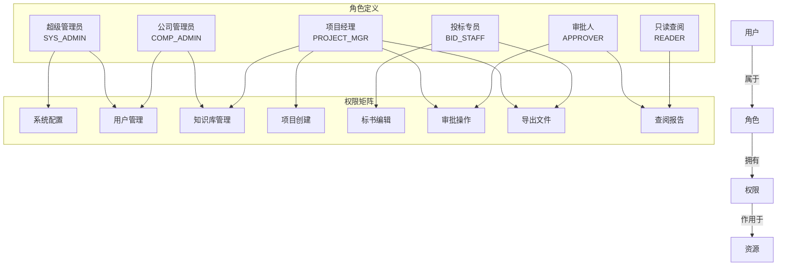
```mermaid
graph TD
    USER[用户] -->|属于| ROLE[角色]
    ROLE -->|拥有| PERM[权限]
    PERM -->|作用于| RES[资源]

    subgraph 角色定义
        R1[超级管理员\nSYS_ADMIN]
        R2[公司管理员\nCOMP_ADMIN]
        R3[项目经理\nPROJECT_MGR]
        R4[投标专员\nBID_STAFF]
        R5[审批人\nAPPROVER]
        R6[只读查阅\nREADER]
    end

    subgraph 权限矩阵
        P1[系统配置]
        P2[用户管理]
        P3[知识库管理]
        P4[项目创建]
        P5[标书编辑]
        P6[审批操作]
        P7[导出文件]
        P8[查阅报告]
    end

    R1 --> P1
    R1 --> P2
    R2 --> P2
    R2 --> P3
    R3 --> P3
    R3 --> P4
    R3 --> P6
    R3 --> P7
    R4 --> P5
    R4 --> P7
    R5 --> P6
    R5 --> P8
    R6 --> P8
```

#### 4.6.2 数据安全措施

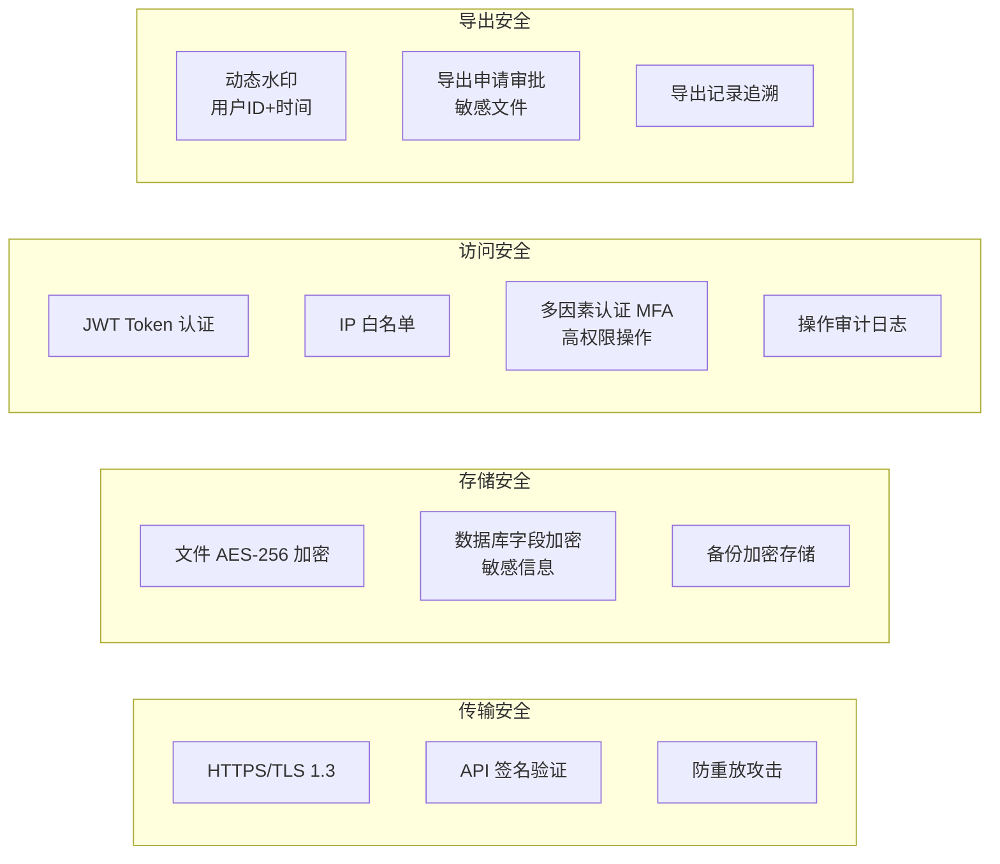
```mermaid
graph LR
    subgraph 传输安全
        T1[HTTPS/TLS 1.3]
        T2[API 签名验证]
        T3[防重放攻击]
    end

    subgraph 存储安全
        S1[文件 AES-256 加密]
        S2[数据库字段加密\n敏感信息]
        S3[备份加密存储]
    end

    subgraph 访问安全
        A1[JWT Token 认证]
        A2[IP 白名单]
        A3[多因素认证 MFA\n高权限操作]
        A4[操作审计日志]
    end

    subgraph 导出安全
        E1[动态水印\n用户ID+时间]
        E2[导出申请审批\n敏感文件]
        E3[导出记录追溯]
    end
```

### 4.7 版本控制与协同设计

#### 4.7.1 文档版本控制

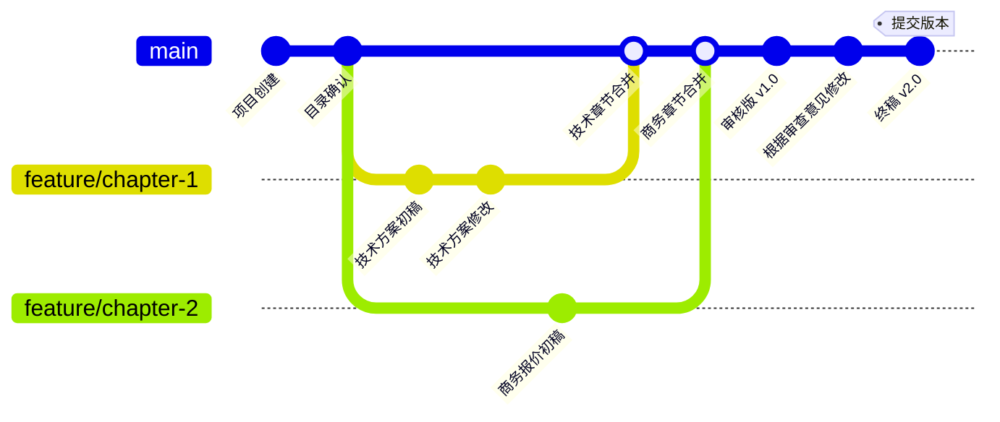
```mermaid
gitGraph
    commit id: "项目创建"
    commit id: "目录确认"
    branch feature/chapter-1
    checkout feature/chapter-1
    commit id: "技术方案初稿"
    commit id: "技术方案修改"
    checkout main
    branch feature/chapter-2
    checkout feature/chapter-2
    commit id: "商务报价初稿"
    checkout main
    merge feature/chapter-1 id: "技术章节合并"
    merge feature/chapter-2 id: "商务章节合并"
    commit id: "审核版 v1.0"
    commit id: "根据审查意见修改"
    commit id: "终稿 v2.0" tag: "提交版本"
```

#### 4.7.2 多人协同机制

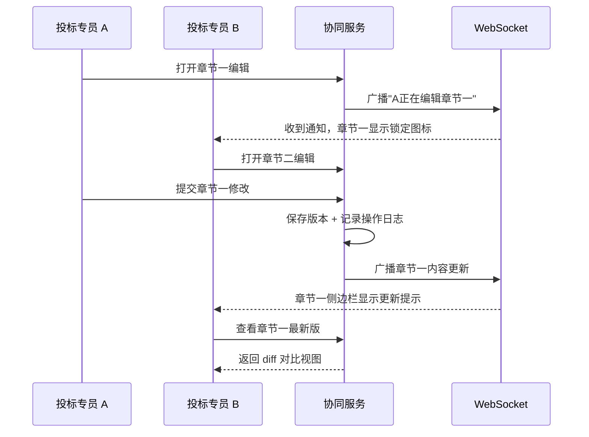
```mermaid
sequenceDiagram
    participant A as 投标专员 A
    participant B as 投标专员 B
    participant SVC as 协同服务
    participant WS as WebSocket

    A->>SVC: 打开章节一编辑
    SVC->>WS: 广播"A正在编辑章节一"
    WS-->>B: 收到通知，章节一显示锁定图标

    B->>SVC: 打开章节二编辑
    A->>SVC: 提交章节一修改
    SVC->>SVC: 保存版本 + 记录操作日志
    SVC->>WS: 广播章节一内容更新
    WS-->>B: 章节一侧边栏显示更新提示

    B->>SVC: 查看章节一最新版
    SVC-->>B: 返回 diff 对比视图
```

### 4.8 核心 API 接口设计

#### 4.8.1 主要接口列表

```
# 项目管理
POST   /api/v1/projects                    # 创建投标项目
GET    /api/v1/projects/{id}               # 获取项目详情
GET    /api/v1/projects/{id}/win-rate      # 胜率预测

# 文档解析
POST   /api/v1/documents/parse             # 上传并解析文档
GET    /api/v1/documents/{id}/constraints  # 获取提取的约束列表
PUT    /api/v1/documents/{id}/constraints  # 确认/修改约束

# 知识库
POST   /api/v1/knowledge/search            # 语义检索
POST   /api/v1/knowledge/upload            # 上传素材入库
GET    /api/v1/knowledge/stats             # 知识库统计

# 标书编写
POST   /api/v1/bids/{id}/outline           # 生成目录结构
POST   /api/v1/bids/{id}/sections/{sid}/generate  # 生成章节内容
PUT    /api/v1/bids/{id}/sections/{sid}    # 编辑章节内容
GET    /api/v1/bids/{id}/check             # 执行一致性检查

# 审查
POST   /api/v1/reviews                     # 创建审查任务
GET    /api/v1/reviews/{id}/result         # 获取审查结果
GET    /api/v1/reviews/{id}/report         # 导出审查报告

# 串标分析
POST   /api/v1/collusion/analyze           # 提交串标分析任务
GET    /api/v1/collusion/{id}/result       # 获取分析结果

# 导出
POST   /api/v1/bids/{id}/export            # 导出标书
```

#### 4.8.2 关键接口规范示例

```json
// POST /api/v1/bids/{id}/sections/{sid}/generate
// 请求体
{
  "section_type": "FREE_NARRATIVE",
  "constraints": ["C001", "C005", "C012"],
  "knowledge_refs": ["kb_001", "kb_023"],
  "style": "professional",
  "length_hint": "detailed",
  "extra_instruction": "重点突出我司在数据中心领域的建设经验"
}

// 响应体
{
  "code": 200,
  "data": {
    "section_id": "sid_xxx",
    "content": "生成的章节内容...",
    "word_count": 1240,
    "references": [
      {"kb_id": "kb_001", "title": "XX数据中心项目方案", "page": 12}
    ],
    "constraint_coverage": {
      "covered": ["C001", "C005"],
      "uncovered": ["C012"],
      "coverage_rate": 0.67
    },
    "confidence": 0.82
  }
}
```

---

## 5. 实施路径

### 5.1 总体实施计划

```mermaid
gantt
    title AI 智能投标系统实施甘特图
    dateFormat  YYYY-MM-DD
    section 第一期（核心基础）
    需求评审与确认          :a1, 2026-05-01, 14d
    系统架构设计            :a2, after a1, 14d
    基础设施搭建            :a3, after a2, 14d
    知识库建设与数据入库     :a4, after a2, 45d
    招标文件解析引擎         :a5, after a3, 30d
    投标审查功能            :a6, after a5, 21d
    基础权限系统            :a7, after a3, 21d
    第一期测试与上线         :a8, after a6, 14d

    section 第二期（编写核心）
    AI 协同编写引擎         :b1, after a8, 35d
    目录规划与素材匹配       :b2, after a8, 28d
    版本控制与多人协同       :b3, after a8, 21d
    全局变量与一致性检查     :b4, after b1, 21d
    标书预览导出            :b5, after b4, 14d
    第二期测试与上线         :b6, after b5, 14d

    section 第三期（智能提升）
    胜率预测模型            :c1, after b6, 35d
    串标分析引擎            :c2, after b6, 35d
    投标复盘与知识沉淀       :c3, after b6, 21d
    移动端开发              :c4, after b6, 42d
    数据统计看板            :c5, after c3, 21d
    第三期测试与上线         :c6, after c5, 14d

    section 第四期（集成优化）
    OA/ERP 系统集成        :d1, after c6, 28d
    性能调优与压测          :d2, after c6, 21d
    用户培训与推广          :d3, after c6, 42d
    全面运营               :d4, after d3, 14d
```

### 5.2 分期交付目标

#### 第一期（约 4 个月）：核心价值验证

**核心目标**：让审查功能可用，消除废标风险，快速产生可见价值。

| 交付物 | 验收标准 |
|---|---|
| 招标文件解析引擎 | 约束提取准确率 ≥ 85%，PDF 解析成功率 ≥ 95% |
| 投标审查功能 | 支持全流程审查，生成结构化报告，PDF 原文定位准确 |
| 企业知识库（基础版）| 完成历史 50 个项目入库，语义检索响应 < 3 秒 |
| 权限系统 | 支持 5 种角色，操作审计日志完整 |

#### 第二期（约 4 个月）：编写效率提升

**核心目标**：AI 辅助编写上线，单标书工时降低 50%。

| 交付物 | 验收标准 |
|---|---|
| AI 协同编写引擎 | 三分法路由准确率 ≥ 90%，生成内容人工满意度 ≥ 75% |
| 知识库语义检索 | 自然语言查询准确率 ≥ 80% |
| 一致性检查引擎 | 数据不一致问题检出率 ≥ 95% |
| 多人协同版本控制 | 支持 5 人同时编辑，版本历史完整追溯 |
| 标书导出 | Word/PDF 格式导出，格式正确率 100% |

#### 第三期（约 4 个月）：智能决策支持

**核心目标**：胜率预测与串标分析上线，形成数据闭环。

| 交付物 | 验收标准 |
|---|---|
| 胜率预测模型 | 预测评分与实际结果相关性 ≥ 0.6 |
| 串标分析引擎 | 串标特征检出率 ≥ 85%，误报率 ≤ 10% |
| 复盘沉淀机制 | 支持结果录入、失标分析、优质内容入库全流程 |
| 移动端 | 支持审批、查阅、通知推送核心功能 |

#### 第四期（约 2 个月）：整合优化

| 交付物 | 验收标准 |
|---|---|
| OA/ERP 集成 | 项目信息双向同步，无需手动录入 |
| 性能优化 | 并发 50 用户，核心接口响应 < 2 秒 |
| 数据看板 | 中标率/工时/知识库健康度等核心指标可视化 |

### 5.3 数据冷启动方案

知识库的质量决定系统的智能水平，需要提前规划数据准备：

```mermaid
flowchart TD
    A[历史数据盘点] --> B{数据质量评估}
    B -->|高质量| C[批量自动入库]
    B -->|中等质量| D[半自动入库\n人工校验]
    B -->|低质量/缺失| E[人工补录]

    C --> F[结构化标注]
    D --> F
    E --> F

    F --> G{覆盖度检查}
    G -->|资质库| H[检查证书完整性 & 有效期]
    G -->|业绩库| I[至少 50 个完整项目案例]
    G -->|人员库| J[全员简历 & 证书录入]
    G -->|方案库| K[各行业优质方案 5 套以上]

    H --> L[知识库健康度评分]
    I --> L
    J --> L
    K --> L

    L -->|≥ 70分| M[可上线运行]
    L -->|< 70分| N[补充数据后再评估]
```

**建议数据准备时间表：**

| 阶段 | 任务 | 负责人 | 工时估算 |
|---|---|---|---|
| 启动前 2 周 | 历史标书电子化（扫描） | IT 支持 | 40 小时 |
| 启动前 2 周 | 资质证书汇总入库 | 行政 | 16 小时 |
| 第 1~4 周 | 历史标书批量解析入库 | 系统自动 + 人工校验 | 40 小时 |
| 第 3~6 周 | 人员信息录入 | 各部门 | 24 小时 |
| 持续进行 | 新标书完成后及时复盘入库 | 投标专员 | 常态化 |

---

## 6. 风险与应对

### 6.1 风险矩阵

```mermaid
quadrantChart
    title 风险矩阵（概率 vs 影响）
    x-axis 低影响 --> 高影响
    y-axis 低概率 --> 高概率
    quadrant-1 重点关注
    quadrant-2 密切监控
    quadrant-3 可接受
    quadrant-4 预防为主
    AI内容质量不达标: [0.75, 0.70]
    数据冷启动困难: [0.60, 0.75]
    大模型数据安全泄露: [0.85, 0.40]
    用户接受度低: [0.55, 0.65]
    系统性能不足: [0.65, 0.35]
    核心人员流失: [0.70, 0.30]
    第三方API依赖中断: [0.45, 0.35]
    法律合规风险: [0.80, 0.25]
```

### 6.2 主要风险详情与应对

| 风险编号 | 风险描述 | 概率 | 影响 | 应对策略 | 应急预案 |
|---|---|---|---|---|---|
| R01 | AI 生成内容质量不稳定，出现事实性错误或逻辑混乱 | 高 | 高 | 保留人工审核节点；使用 RAG 限制 LLM 幻觉；建立内容质量评估机制 | 该功能降级为辅助建议，不自动填入标书 |
| R02 | 历史数据质量差，知识库冷启动效果不佳 | 高 | 中 | 提前规划数据治理；设置知识库健康度门槛；人工专项补录 | 第一期先以规则+模板覆盖，待数据积累后再上 AI 推荐 |
| R03 | LLM 处理敏感数据存在泄露风险 | 中 | 高 | 优先私有化部署大模型；明确敏感数据不传外部 API；数据脱敏处理 | 公有云 API 仅处理非敏感内容，敏感章节强制本地模型 |
| R04 | 用户习惯难以改变，系统使用率低 | 高 | 中 | 分期上线减少冲击；设计激励机制；投标专员深度参与需求设计 | 设置使用率 KPI，管理层强制推行关键功能 |
| R05 | 并发用户增加时系统性能下降 | 中 | 中 | 架构设计时考虑水平扩展；K8s 自动扩容；核心接口压测 | 限流降级策略；异步任务队列削峰 |
| R06 | 串标分析报告的法律效力存疑 | 低 | 高 | 报告定位为"辅助参考"，不作为法律证据；与法务部门确认使用边界 | 在报告首页明确免责声明 |

---

## 7. 运维与治理

### 7.1 系统监控体系

```mermaid
graph TD
    subgraph 监控采集层
        APP_M[应用指标\nPrometheus]
        LOG_M[日志采集\nFilebeat/Fluentd]
        TRACE_M[链路追踪\nJaeger/Zipkin]
        DB_M[数据库监控\n慢查询/连接数]
    end

    subgraph 监控存储层
        PROM[(Prometheus\n指标存储)]
        ES_LOG[(Elasticsearch\n日志存储)]
        JAEGER[(Jaeger\n链路存储)]
    end

    subgraph 展示与告警层
        GRAFANA[Grafana 大盘\n业务+基础设施]
        KIBANA[Kibana\n日志分析]
        ALERT[AlertManager\n告警路由]
    end

    subgraph 通知渠道
        DINGDING[钉钉/企业微信]
        EMAIL[邮件]
        SMS[短信（P0告警）]
    end

    APP_M --> PROM
    LOG_M --> ES_LOG
    TRACE_M --> JAEGER
    DB_M --> PROM

    PROM --> GRAFANA
    ES_LOG --> KIBANA
    PROM --> ALERT

    ALERT --> DINGDING
    ALERT --> EMAIL
    ALERT --> SMS
```

**核心监控指标：**

| 指标类型 | 关键指标 | 告警阈值 |
|---|---|---|
| 服务可用性 | 服务正常运行率 | < 99.5% 告警 |
| 响应性能 | P99 接口响应时间 | > 5 秒告警 |
| AI 质量 | LLM 生成失败率 | > 5% 告警 |
| 存储容量 | 磁盘使用率 | > 80% 告警 |
| 数据库 | 慢查询数量（> 2s）| > 10 次/分钟 告警 |
| 知识库 | 向量检索召回率 | < 70% 告警 |

### 7.2 SLA 与灾备设计

```mermaid
graph LR
    subgraph 主数据中心
        ACTIVE[主集群\n完整服务]
        DB_ACTIVE[(主数据库\n实时写入)]
        FILE_ACTIVE[(主文件存储)]
    end

    subgraph 备数据中心
        STANDBY[备集群\n热备状态]
        DB_STANDBY[(从数据库\n实时同步)]
        FILE_STANDBY[(备文件存储\n异步同步)]
    end

    DB_ACTIVE -->|实时主从同步\nRPO < 1min| DB_STANDBY
    FILE_ACTIVE -->|异步同步\nRPO < 1h| FILE_STANDBY
    ACTIVE -->|健康检查| STANDBY
```

| SLA 目标 | 指标 |
|---|---|
| 系统可用性 | 99.5%（每月允许停机 < 4 小时） |
| RTO（恢复时间目标） | < 2 小时 |
| RPO（恢复点目标）| < 1 小时 |
| 数据备份频率 | 数据库每日全量 + 实时增量；文件每日增量 |
| 备份保留周期 | 近 7 天每日备份，近 4 周每周备份，近 12 个月每月备份 |

### 7.3 AI 模型治理

```mermaid
flowchart TD
    A[模型上线评估] --> B{评估通过?}
    B -->|否| A
    B -->|是| C[灰度发布 5%]
    C --> D[质量监控\n准确率/满意度]
    D --> E{指标达标?}
    E -->|否| F[回滚前版本]
    E -->|是| G[扩大至 50%]
    G --> H{指标达标?}
    H -->|否| F
    H -->|是| I[全量发布 100%]
    I --> J[持续监控]
    J --> K{出现质量下降?}
    K -->|是| L[触发模型再训练/微调]
    K -->|否| J
    L --> A
```

**模型质量评估维度：**

| 评估维度 | 评估方式 | 频率 |
|---|---|---|
| 约束提取准确率 | 人工抽样标注对比 | 每月 |
| 内容生成满意度 | 用户评分（1~5 星）| 实时统计 |
| 检索相关度 | NDCG / MRR 指标 | 每周 |
| 胜率预测准确性 | 预测分 vs 实际结果回归分析 | 每季度 |
| 幻觉率 | 人工抽查事实错误 | 每月 |

### 7.4 知识库健康度治理

```mermaid
graph TD
    HEALTH[知识库健康度评估\n每周自动运行] --> DIM1[覆盖度\n各类型文档数量]
    HEALTH --> DIM2[时效性\n过期证书/陈旧素材占比]
    HEALTH --> DIM3[质量度\n低置信度内容占比]
    HEALTH --> DIM4[活跃度\n最近30天入库/使用量]

    DIM1 --> SCORE_KB[健康度综合评分]
    DIM2 --> SCORE_KB
    DIM3 --> SCORE_KB
    DIM4 --> SCORE_KB

    SCORE_KB --> ACT{分数判断}
    ACT -->|≥ 80分| GREEN[健康 - 正常运行]
    ACT -->|60~80分| YELLOW[预警 - 推送补录建议]
    ACT -->|< 60分| RED[告警 - 推送给管理员处理]
```

### 7.5 数据生命周期管理

| 数据类型 | 热数据（高速访问）| 温数据（定期访问）| 冷数据（归档）|
|---|---|---|---|
| 标书文件 | 最近 6 个月 | 6 个月~3 年 | 3 年以上 |
| 知识库向量 | 全量（Milvus）| — | 退役后压缩存储 |
| 操作日志 | 最近 30 天 | 30 天~6 个月 | 6 个月以上（合规保留 3 年）|
| 审查报告 | 最近 1 年 | 1~5 年 | 5 年以上 |

---

## 8. 主要收益

### 8.1 效率收益

**单次投标编制工时对比（目标）：**

```mermaid
xychart-beta
    title "单次投标编制工时对比（小时）"
    x-axis ["招标文件解读", "素材收集", "内容编写", "审核修改", "合规检查", "合计"]
    y-axis "工时（小时）" 0 --> 90
    bar [12, 6, 28, 12, 3, 61]
    bar [2, 0.5, 10, 6, 0.5, 19]
```

| 环节 | 现状工时 | 目标工时 | 节省比例 |
|---|---|---|---|
| 招标文件解读 | 8~16 h | 1~2 h | ↓ 85% |
| 素材收集 | 4~8 h | 0.5 h | ↓ 90% |
| 内容编写 | 16~40 h | 8~12 h | ↓ 65% |
| 审核修改 | 8~16 h | 4~8 h | ↓ 40% |
| 合规检查 | 2~4 h | 0.5 h | ↓ 85% |
| **合计** | **38~84 h** | **14~23 h** | **↓ 约 65%** |

### 8.2 质量收益

| 质量维度 | 现状 | 目标 | 提升方式 |
|---|---|---|---|
| 因格式/数据错误废标率 | 约 5~8% | 0% | 一致性检查 + 合规自审 |
| 综合中标率 | 基准值 | 提升 15~25% | 胜率预测 + 模拟评标 + 内容优化 |
| 新人独立完成标书周期 | 3 个月 | 2 周 | AI 辅助 + 知识库支撑 |
| 标书内容质量评分（内部）| 基准值 | 提升 20%+ | 专家知识外化 + AI 生成 |

### 8.3 知识资产收益

```mermaid
graph LR
    subgraph 短期（1年内）
        K1[结构化历史项目 100+]
        K2[消除个人知识孤岛]
        K3[证书到期 0 遗漏]
    end

    subgraph 中期（2~3年）
        K4[知识库项目 300+]
        K5[胜率模型准确率持续提升]
        K6[行业细分优质方案库建成]
    end

    subgraph 长期（3年以上）
        K7[企业核心竞争力数字化]
        K8[新业务拓展支撑能力]
        K9[组织知识自我进化]
    end

    K1 --> K4
    K2 --> K5
    K3 --> K6
    K4 --> K7
    K5 --> K8
    K6 --> K9
```

### 8.4 经济收益估算

> 以下为参考性估算，实际数据以企业真实情况为准。

**假设条件：**
- 年度投标项目：100 个/年
- 平均每标投入人力：2 人 × 3 天 = 48 人·时
- 人力成本：200 元/小时
- 当前中标率：25%，平均合同额：500 万元

| 收益项目 | 估算方式 | 年度估算值 |
|---|---|---|
| **工时节省（直接成本）** | 100 标 × 29 小时节省 × 200 元/小时 | **58 万元/年** |
| **废标损失避免** | 5 个废标 × 平均前期成本 3 万元 | **15 万元/年** |
| **中标率提升（增量收入）** | 中标率提升 5% → 年度新增 5 个标 × 500 万 × 5% 毛利率 | **125 万元/年** |
| **合计年度收益** | — | **≈ 198 万元/年** |

---

## 9. 附录

### 9.1 技术术语说明

| 术语 | 全称 | 说明 |
|---|---|---|
| RAG | Retrieval-Augmented Generation | 检索增强生成，将外部知识库检索结果注入 LLM 提示词，减少幻觉 |
| LLM | Large Language Model | 大语言模型，如 GPT-4、Claude、Qwen、DeepSeek 等 |
| OCR | Optical Character Recognition | 光学字符识别，将扫描件图片转化为可编辑文本 |
| NLP | Natural Language Processing | 自然语言处理，用于实体提取、分类、语义理解等 |
| Embedding | — | 向量化，将文本转化为高维数值向量，用于语义相似度计算 |
| ANN | Approximate Nearest Neighbor | 近似最近邻搜索，向量数据库的核心检索算法 |
| RBAC | Role-Based Access Control | 基于角色的访问控制 |
| SSO | Single Sign-On | 单点登录，统一身份认证 |
| RTO | Recovery Time Objective | 恢复时间目标，系统故障后最长恢复时间 |
| RPO | Recovery Point Objective | 恢复点目标，可接受的最大数据丢失时间窗口 |

### 9.2 关键依赖清单

| 类型 | 组件 | 版本要求 | 授权方式 |
|---|---|---|---|
| 开源框架 | Vue 3 | ≥ 3.4 | MIT |
| 开源框架 | FastAPI | ≥ 0.110 | MIT |
| 开源框架 | Spring Boot | ≥ 3.2 | Apache 2.0 |
| 数据库 | PostgreSQL | ≥ 15 | PostgreSQL License |
| 向量数据库 | Milvus | ≥ 2.4 | Apache 2.0 |
| 检索引擎 | Elasticsearch | ≥ 8.0 | Elastic License |
| 对象存储 | MinIO | 最新稳定版 | AGPL-3.0 |
| AI 框架 | LangChain | ≥ 0.2 | MIT |
| OCR | PaddleOCR | ≥ 2.7 | Apache 2.0 |
| 容器编排 | Kubernetes | ≥ 1.28 | Apache 2.0 |
| 大模型（私有）| Qwen2.5 / DeepSeek-V3 | 按需选型 | 商业/Apache 2.0 |

### 9.3 服务器资源需求估算

| 节点类型 | 规格 | 数量 | 用途 |
|---|---|---|---|
| 应用服务节点 | 16C / 32G | 3 台 | 业务微服务部署 |
| AI 推理节点（GPU）| A100 80G 或同级 | 2 台 | LLM 私有化推理 |
| AI 辅助节点（CPU）| 32C / 64G | 2 台 | OCR/NLP/Embedding |
| 数据库节点 | 16C / 64G / SSD 2TB | 2 台 | PG 主从 |
| 检索节点 | 16C / 32G / SSD 1TB | 3 台 | ES 集群 |
| 向量数据库节点 | 16C / 64G / SSD 500G | 3 台 | Milvus 集群 |
| 存储节点 | 8C / 16G / HDD 20TB | 3 台 | MinIO 集群 |
| 负载均衡节点 | 8C / 16G | 2 台 | Nginx 主备 |

> 以上为初期配置，可根据实际并发量和数据规模弹性调整。

---

*本文档为 AI 智能投标系统技术方案，如有修订请更新文档版本号并记录变更历史。*

*© 2026 内部保密文件，未经授权不得外传。*
